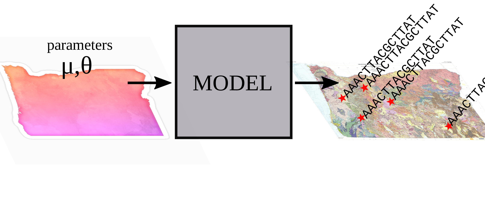
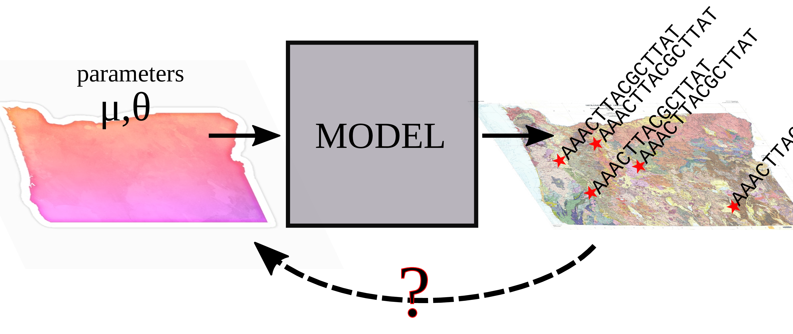
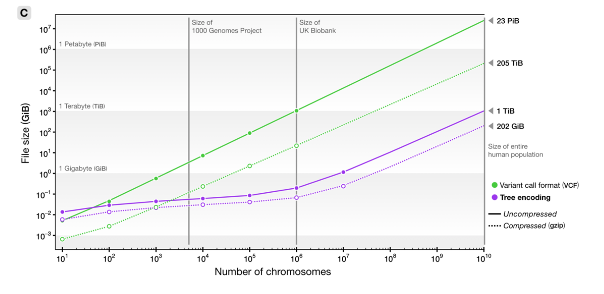
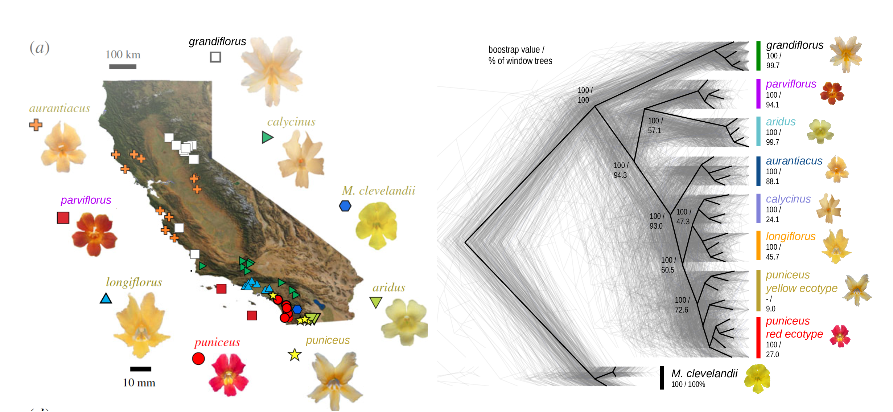
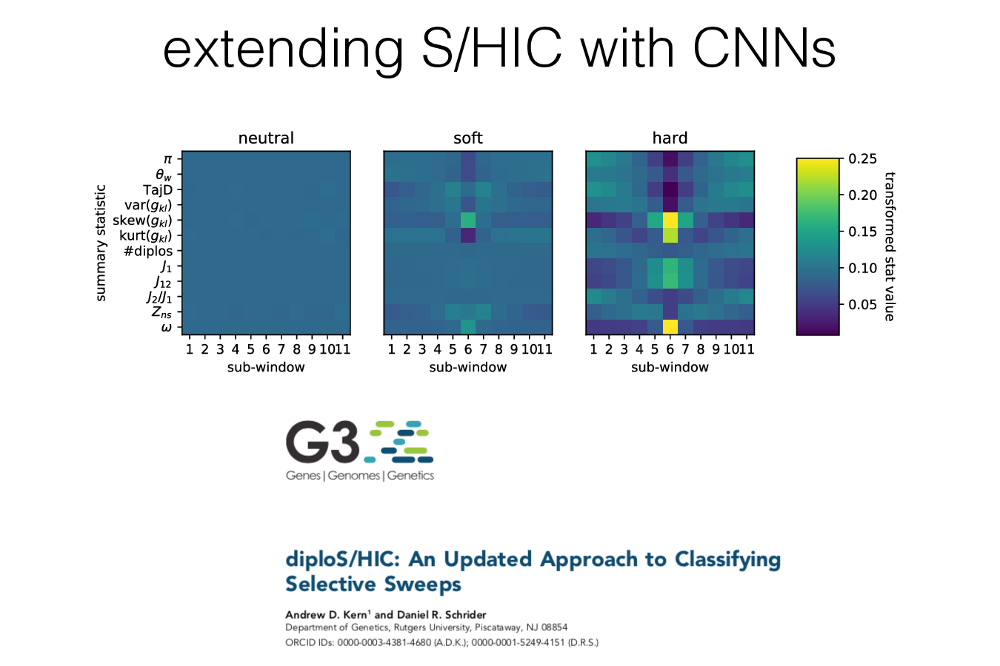
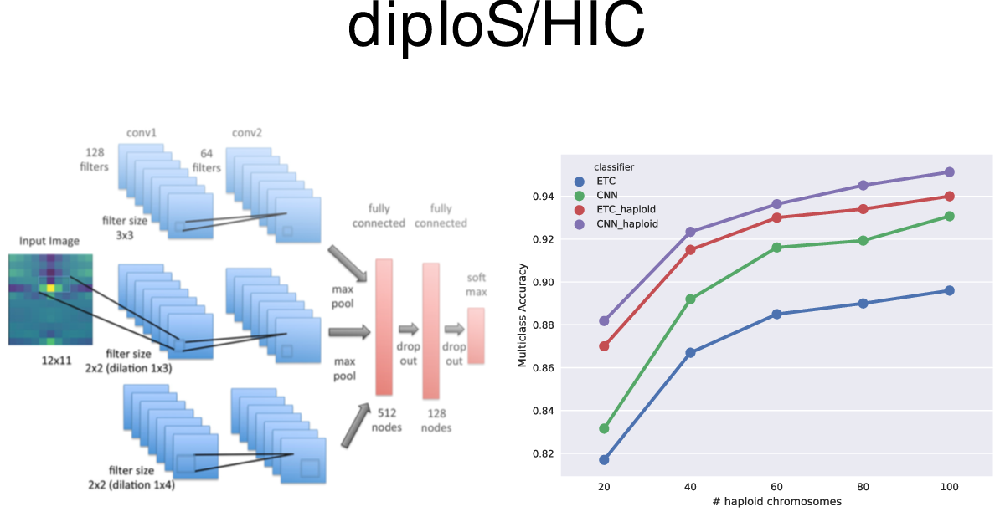
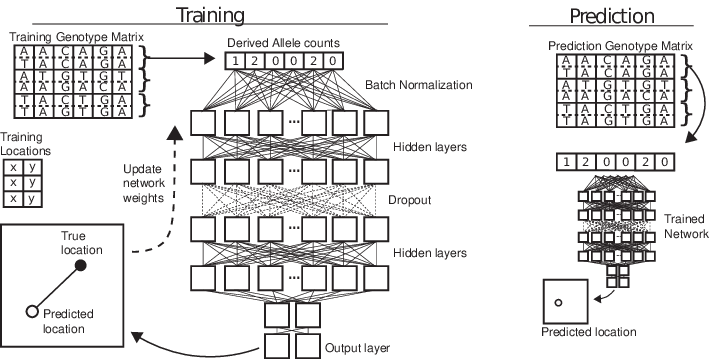
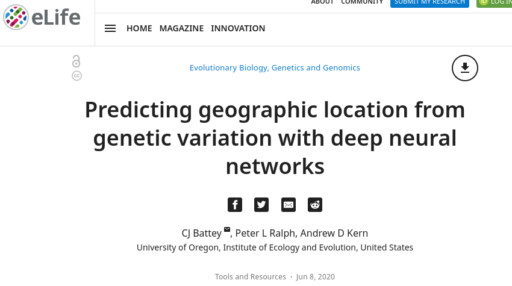
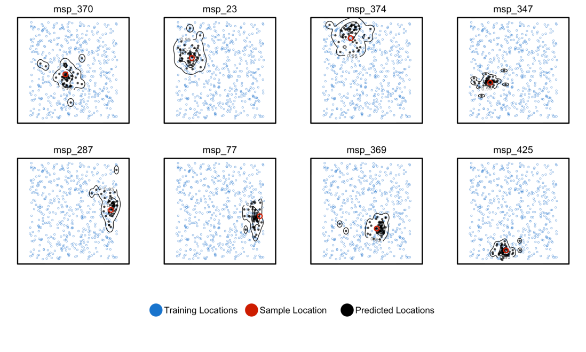

# Outline

## Outline of the talk

1. What do we need simulations for?
2. The tree sequence
3. Applications

*slides:* [github.com/petrelharp/osu-may-2021](https://petrelharp.github.io/osu-may-2021/osu-may-2021.slides.html)

# Simulation-based inference

## Some questions

1. What forces contribute to the variation in genetic diversity
    along the genome? *(explaining variation in diversity)*

2. Which locations along the genome have been the recent targets
    of positive natural selection? *(identifying sweeps)*

3. Where did this individual come from?
    *(inferring location)*

4. How do organisms disperse across the landscape? *(dispersal maps)*

## Inverse problems

## Inverse problems

## Inverse problems

## Inverse problems

## Simulation-based inference

::: {.centered}
{width=60%}
:::

- bespoke confirmatory simulations
- optimization of one or two parameters
    <!-- *(if between-simulation noise is small)* -->
- machine learning predictors (e.g., random forests)
- Approximate Bayesian Computation (ABC)
- deep learning

# What do we need

<!--
## Ok, then: selection.

:::: {.columns}
:::::::: {.column width=50%}

To test theories and fit models, we need *simulations* with realistic

1. population sizes,
2. ecology,
2. genomes,
3. selective pressures,
4. histories, and
5. geography.

::::
:::::::: {.column width=50%}

::::
::::::::

-->

## Wish list:

::: {.smallish}

::: {.columns}
::::::: {.column}

Whole genomes,
thousands of samples, \
from millions of individuals.

**Demography:**

- life history 
- separate sexes
- selfing
- polyploidy
- species interactions

**Geography:**

- discrete populations
- continuous landscapes
- barriers

**History:**

- ancient samples
- range shifts

:::
::::::: {.column}

**Natural selection:**

- selective sweeps
- introgressing alleles
- background selection
- quantitative traits
- incompatibilities
- local adaptation

**Genomes:**

- recombination rate variation
- gene conversion
- infinite-sites mutation
- nucleotide models
- context-dependence
- mobile elements
- inversions
- copy number variation

:::
:::::::

:::

## {data-background-image="figs/oregon_geological_map.png"}

## Enter SLiM

::: {.columns}
::::::: {.column width=50%}

by Ben Haller and Philipp Messer

- a forwards simulator
- arbitary life cycles
- continuous geography and local interactions
- quantitative traits
- anything is possible

:::: {.caption}

*Ben Haller*
::::

:::
::::::: {.column width=50%}

[messerlab.org/SLiM](https://messerlab.org/SLiM/)

:::
:::::::

## {data-background-image="figs/slim_screenshot.png" data-background-position=center data-background-size=100%}

##

::: {.smallish}

::: {.columns}
::::::: {.column}

- <s>Whole genomes,</s>*
- <s>thousands of samples, </s>
- <s>from millions of individuals.</s>*

**Demography:**

- <s>life history</s>
- <s>separate sexes</s>*
- <s>selfing</s>
- polyploidy*
- species interactions **(coming soon!)**

**Geography:**

- <s>discrete populations</s>
- <s>continuous landscapes</s>
- <s>barriers</s>*

**History:**

- <s>ancient samples</s>
- <s>range shifts</s>

:::
::::::: {.column}

**Natural selection:**

- <s>selective sweeps</s>
- <s>introgressing alleles</s>
- <s>background selection</s>
- <s>quantitative traits</s>*
- <s>incompatibilities</s>*
- <s>local adaptation</s>*

**Genomes:**

- <s>recombination rate variation</s>
- <s>gene conversion</s>
- <s>infinite-sites mutation</s>
- <s>nucleotide models</s>
- <s>context-dependence</s>*
- mobile elements*
- inversions*
- copy number variation

:::
:::::::

:::

## 

- <s>Whole genomes,</s>*

. . .

Idea: if we record *how everyone is related to everyone else*,

. . .

we can put down neutral mutations
*after the simulation is over*
instead of carrying them along.

. . .

Since neutral mutations don't affect demography,

this is *equivalent* to having kept track of them throughout.

<!-- Tree sequences -->

# The tree sequence

## History is a sequence of trees

For a set of sampled chromosomes,
at each position along the genome there is a genealogical tree
that says how they are related.

. . .

----------------------

The **succinct tree sequence**

::: {.floatright}
is a way to succinctly describe this, er, sequence of trees

*and* the resulting genome sequences.

:::: {.caption}
[Kelleher, Etheridge, & McVean](http://journals.plos.org/ploscompbiol/article?id=10.1371/journal.pcbi.1004842) 
::::
:::

. . .

::: {.columns}
:::::: {.column width=50%}

{width=80%}

:::
:::::: {.column width=50%}

::: {.floatright}
{width=50%}

:::: {.caption}
jerome kelleher
::::

:::

:::
::::::

## Example: three samples; two trees; two variant sites

## Nodes and edges

Edges 

:   Who inherits from who.

    Records: interval (left, right); parent node; child node.

Nodes 

:   The ancestors those happen in.

    Records: time ago (of birth); ID (implicit).

-------------------

-------------------

-------------------

-------------------

-------------------

-------------------

-------------------

## Sites and mutations

Mutations

:   When state changes along the tree.

    Records: site it occured at; node it occurred in; derived state.

Sites 

:   Where mutations fall on the genome.

    Records: genomic position; ancestral (root) state; ID (implicit).

------------------

------------------

------------------

------------------

------------------

------------------

**The result:**
an encoding of the genomes *and* all the genealogical trees.

::: {.centered}

:::

# How's it work?

## File sizes

::: {.centered}
{width=90%}
:::

::: {.caption}
100Mb chromosomes;
from [Kelleher et al 2018, *Inferring whole-genome histories in large population datasets*](https://www.nature.com/articles/s41588-019-0483-y), Nature Genetics
:::

<!-- Estimated sizes of files required to store the genetic variation data for a
simulated human-like chromosome (100 megabases) for up to 10 billion haploid
(5 billion diploid) samples. Simulations were run for 10 1 up to 10 7 haplotypes
using msprime [Kelleher et al., 2016], and the sizes of the resulting files plotted
(points). -->

---------------

---------------

---------------

## For $N$ samples genotyped at $M$ sites

::: {.columns}
::::::: {.column width=50%}

*Genotype matrix*:

$N \times M$ things.

:::
::::::: {.column width=50%}

*Tree sequence:*

- $2N-2$ edges for the first tree
- $\sim 4$ edges per each of $T$ trees
- $M$ mutations

$O(N + T + M)$ things

:::
:::::::

{width=60%}

## Fast genotype statistics, too!

::: {.centered}
{width=70%}
:::

::: {.caption}
from Ralph, Thornton and Kelleher 2019, [Efficiently summarizing relationships in large samples](https://doi.org/10.1534/genetics.120.303253)
:::

# Application to genomic simulations

## The main idea

If we *record the tree sequence*
that relates everyone to everyone else,

after the simulation is over we can put neutral mutations down on the trees.

. . .

Since neutral mutations don't affect demography,

this is *equivalent* to having kept track of them throughout.

. . .

:::: {.columns}
:::::::: {.column width=50%}

:::: {.caption}
From 
Kelleher, Thornton, Ashander, and Ralph 2018,
[Efficient pedigree recording for fast population genetics simulation](https://journals.plos.org/ploscompbiol/article?id=10.1371/journal.pcbi.1006581).

and Haller, Galloway, Kelleher, Messer, and Ralph 2018,
[*Tree‐sequence recording in SLiM opens new horizons for forward‐time simulation of whole genomes*](https://onlinelibrary.wiley.com/doi/abs/10.1111/1755-0998.12968)
:::

::::
:::::::: {.column width=50%}

::: {.floatright}
{width=35%}
{width=30%}
{width=30%}
:::

::::
::::::::

------------

This means recording the entire genetic history of **everyone** in the population, **ever**.

.  . .

It is *not* clear this is a good idea.

. . .

But, with a few tricks...

## A 100x speedup!

::: {.columns}
:::::: {.column width=40%}

::: {.centered}
{width=100%}
:::

:::
:::::: {.column width=60%}

::: {.floatright}
{width=100%}
:::

:::
::::::

## What else can you do with tree sequences?

> - recorded pedigree and migration history
> - true ancestry assignment
> - *recapitation*: fast, post-hoc initialization with coalescent simulation 
> - fast, convenient computation

---------------------

**For example:**

- genome as human chr7 ($1.54 \times 10^8$bp)
- $\approx$ 10,000 diploids
- 500,000 overlapping generations
- continuous, square habitat
- selected mutations at rate $10^{-10}$
- neutral mutations added afterwards

*Runtime:* 8 hours

# Example 1: landscapes of diversity

## Diversity correlates with recombination rate

:::: {.columns}
:::::::: {.column width=80%}

{width=85%}

::::
:::::::: {.column width=20%}

*Hudson 1994; Cutter & Payseur 2013; Corbett-Detig et al 2015*

::::
::::::::

## The *Mimulus aurantiacus* species complex

::: {.centered}

:::

---------------------

:::: {.columns}
:::::::: {.column width=80%}

::::
:::::::: {.column width=20%}

{width="250%"}

::::
::::::::

## Simulations

::: {.columns}
::::::: {.column width="70%"}

- $N=10,000$ diploids
- burn-in for $10N$ generations
- population split, with either:
    
    * neutral
    * background selection
    * selection against introgressed alleles
    * positive selection
    * local adaptation

:::
::::::: {.column width="30%"}

:::: {.flushright}

::::: {.caption}
Murillo Rodrigues
:::::
::::

:::
:::::::

------------------

<!--
Fig 7. Genomic landscapes simulated under different divergence histories.
Each row of plots shows patterns of within- and between-population variation (π, dxy, and FST) across the chromosome (500-kb windows) at 5 time points (N generations, where N = 10,000) during one of the scenarios The selection parameter (Ns, where s = Ns/N), proportion of deleterious (−) and positive mutations (+), and number of migrants per generation (Nm; 0 unless stated) for these simulations are as follows: (i) neutral divergence (no selection), (ii) BGS (−Ns = 100; −prop = 0.1), (iii) BDMI (−Ns = 100, −prop = 0.05, Nm = 0.1), (iv) positive selection (+Ns = 100, +prop = 0.001), (v) BGS and positive selection (−Ns = 100, −prop = 0.1; +Ns = 100, +prop = 0.005), and (vi) local adaptation (+Ns = 100, +prop = 0.001, Nm = 0.1). The gray boxes in the first column show the areas of the chromosome that are experiencing selection, while the white central area evolves neutrally. Note that π (in populations a and b) and dxy have been mean centered so they can be viewed on the same scale. Uncentered values and additional simulations with different parameter combinations and more time points can be found in S13 Fig. BDMI, Bateson-Dobzhansky-Muller incompatibility; BGS, background selection.

-->

{width=100%}

::::: {.flushright}

::::::::::: {.caption}
From [Widespread selection and gene flow shape the genomic landscape during a radiation of monkeyflowers](https://doi.org/10.1371/journal.pbio.3000391),
Stankowski, Chase, Fuiten, Rodrigues, Ralph, and Streisfeld;
PLoS Bio 2019.
:::::::::::
:::::

------------

Conclusions:

* <strike>neutral</strike>
* <strike>background selection</strike>
* <strike>selection against introgressed alleles</strike>
* positive selection
* local adaptation

::::: {.flushright}

::::::::::: {.caption}
From [Widespread selection and gene flow shape the genomic landscape during a radiation of monkeyflowers](https://doi.org/10.1371/journal.pbio.3000391),
Stankowski, Chase, Fuiten, Rodrigues, Ralph, and Streisfeld;
PLoS Bio 2019.
:::::::::::
:::::

# Example 2: identifying sweeps

-----------

# Example 3: predicting location

::::: {.caption}
from [Bradburd & Ralph 2019](https://arxiv.org/abs/1904.09847)
:::::

## 

::: {.centered}

[{width=50%}](https://elifesciences.org/articles/54507)
{width=20%}
:::

## locator ([Battey et al 2020](https://elifesciences.org/articles/54507))

## 

:::: {.flushright}
::::: {.caption}
from [Battey et al 2020](https://elifesciences.org/articles/54507)
:::::
::::

# Example 4: dispersal maps

<!--

::: {.caption}
by [CJ Battey](cjbattey.com)
:::
-->

-------------

- genetic versus geographic distance between pairs of 272 desert tortoises (McCartney-Melstad, Shaffer)
- clouds are comparisons within/between the two colors

-----------

-----------

# Wrap-up

## Software development goals

::: {.columns}
:::::: {.column width=50%}

- open
- welcoming and supportive
- reproducible and well-tested
- backwards compatible
- well-documented
- capacity building

<!--
::: {.centered}
{width=50%}
:::
-->

:::
:::::: {.column width=50%}

::: {.centered}
{width=60%}

[tskit.dev](https://tskit.dev)

<!-- {width=80%} -->
:::

:::
::::::

## Thanks!

:::: {.columns}
:::::::: {.column width=50%}

- Andy Kern
- Matt Lukac
- Murillo Rodrigues 
- Victoria Caudill
- Anastasia Teterina
- Jeff Adrion
<!--
- Saurabh Belsare
- Chris Smith
- Gilia Patterson
- Gabby Coffing
-->
- CJ Battey
- Jared Galloway
- the rest of the Co-Lab

Funding:

- NIH NIGMS
- NSF DBI
- Sloan foundation
- UO Data Science

::::
:::::::: {.column width=50%}

- Jerome Kelleher
- Ben Haller
- Ben Jeffery
- Georgia Tsambos
- Jaime Ashander
- Gideon Bradburd
- Madeline Chase
- Bill Cresko
- Alison Etheridge
- Evan McCartney-Melstad
- Brad Shaffer
- Sean Stankowski
- Matt Streisfeld

::: {.floatright}
{width=40%}
{width=40%}
:::

::::
::::::::

## {data-background-image="figs/guillemots_thanks.png" data-background-position=center data-background-size=50%}
